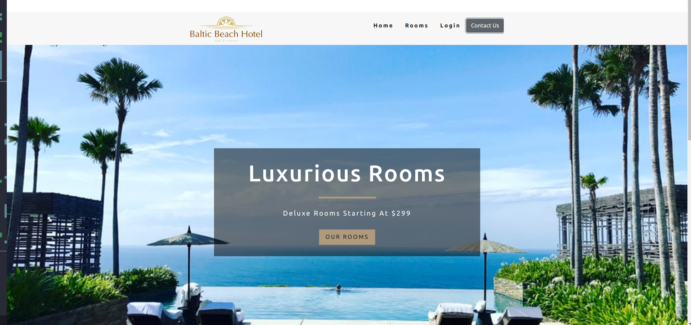
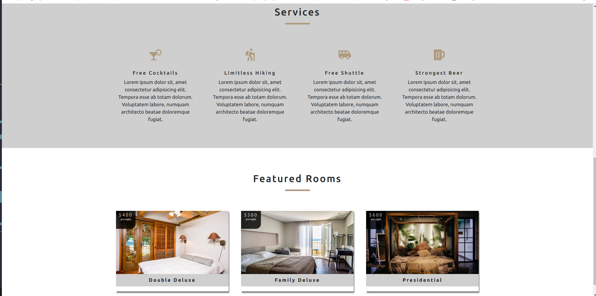
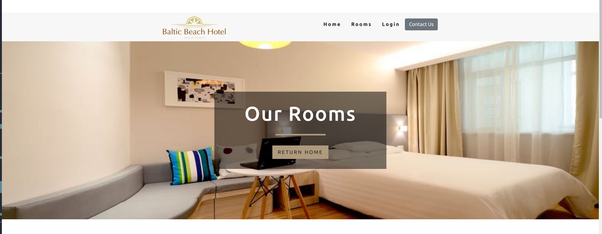
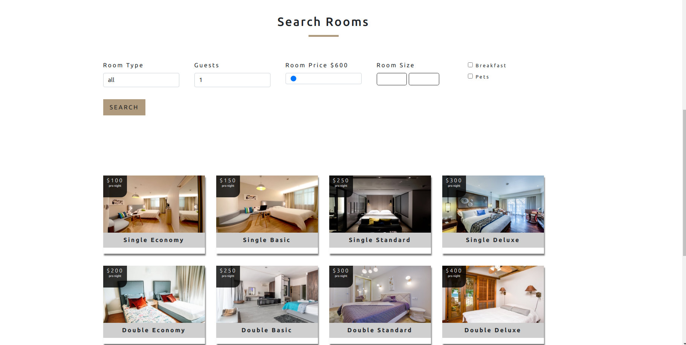

# React Hotel Project

- installed packages

* npm i react-icons
* npm i react-router-dom
* npm i sass
* npm i bootstrap react-bootstrap
* npm i firebase
* npm i react-google-button
* npm i react-icons
* npm i sass

